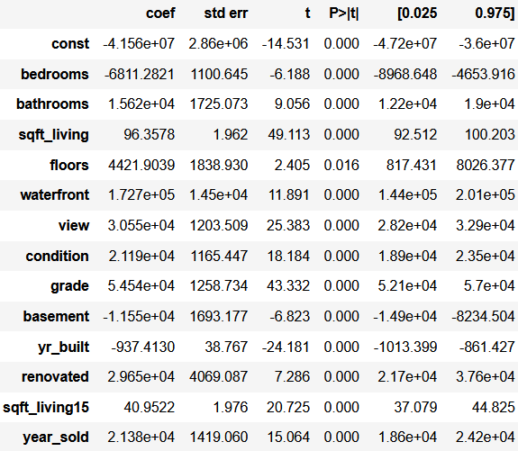
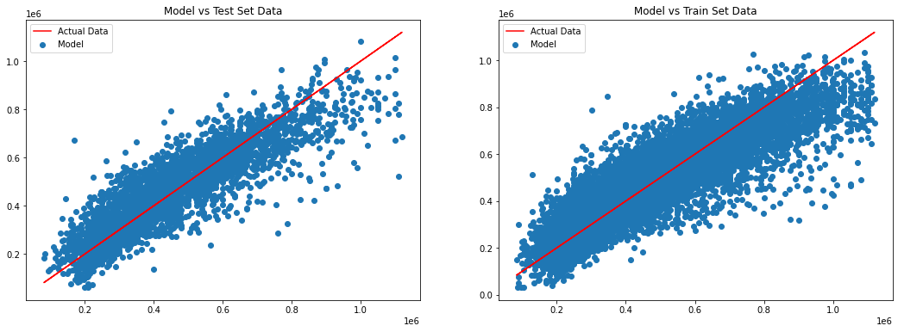

# Kings County Housing Price Analysis

In this project, I analyzed the sale prices of homes in Kings County Washington and the factors that affect it. I used data of Kings County house sale dataset from 2014 and 2015 to do my analysis so the model is not up to date.

The purpose of this project is to narrow down the variables to get a linear regression model which we can analyze and interpret.

## The Final Linear Regression Model 

### Steps taken to arrive at final model.

1. Replace missing and placeholder values with the mode.
2. Get rid of the duplicates.
3. Change the columns that use 0 as a placeholder into binary values.
4. Check for linear relationship assumption between the target and variables.
5. Deal with variables having multicollinearity.
6. Create Dummy Variables for categorical data.
7. Remove outliers from the data.
8. Perform Model Fitting using both RFE and Stepwise Selection.
9. Check the distribution of residuals for normality and heteroskedasticity, using qqplot and residual plot.

The qqplot for the residuals is unsatisfactory but since I intend to use the coefficient to interpret I didn't want to transform the data.

### Interpreting the Model

For the final model, I have 13 continuous and ordinal data variables and 51 categorical zip codes variables. From the coefficients, we can infer that adding 1 bathroom increase about \\$15,620 dollar to the property value. 1 squarefoot increase the price by around \\$96 dollars. Condition(Range from 1 to 5) and grade(Kings County system) have a coefficient of \\$21,190 and \\$54,540 respectively. Renovated properties are typically \\$29,650 more expensive. The non-zipcode variable that has the highest effect on price is the binary variable waterfront. On average, waterfront property sells for $172,700 more.

The zipcodes with the highest prices are:

    98004     City: Bellevue            Neighbourhood:  Bellevue Square / Downtown

    98005     City: Bellevue            Neighbourhood:  Wilburton

    98033     City: Kirkland            Neighbourhood:  

    98040     City: Mercer Island       Neighbourhood:  
    
    98105     City: Seattle             Neighbourhood:  University District

    98112     City: Seattle             Neighbourhood:  Mann / Central Area

    98119     City: Seattle             Neighbourhood:  West Queen Anne / Queen Anne
    
The zipcodes with the lowest prices are:

    98030     City: Kent                

    98092     City: Auburn              

    98003     City: Federal Way            

    98023     City: Federal Way       

    

### Further Improvements
1. Group zip codes into neighbourhoods or cities to simplify the model
2. If the model were to be used for predictions rather than inference I would transform the data so the model performs better.
